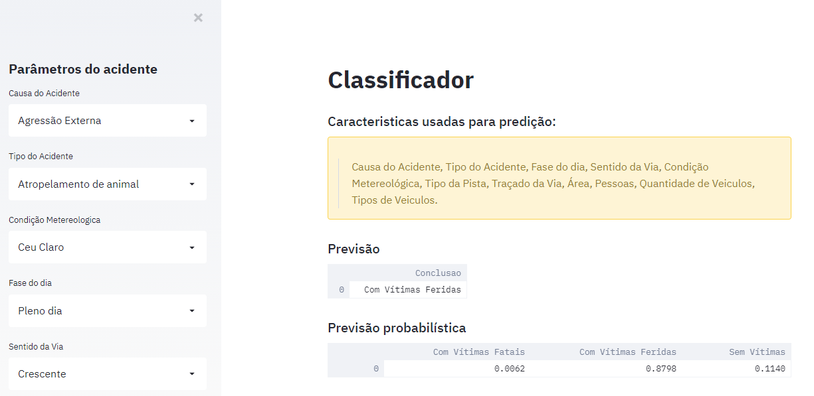

### Analise de Dados da Policia Rodoviaria Federal

Este projeto foi desenvolvido para a disciplina de Ciências de Dados, com o intuito de realizar o tratamento e analise dos dados de acidente de transito da Policia Rodoviaria Federal. Além disso, os dados tratados foram utilizados para a criação de modelos de classifição e regressão e foi criado um DataApp utilizando a biblioteca streamlit.  

Link para o DataAPP: https://previdente.herokuapp.com/

